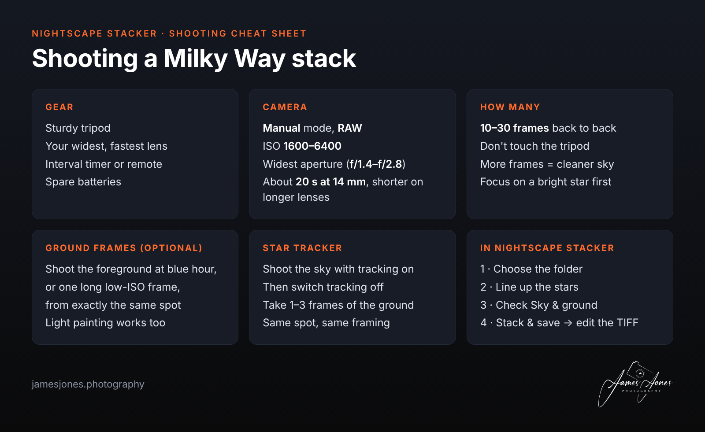
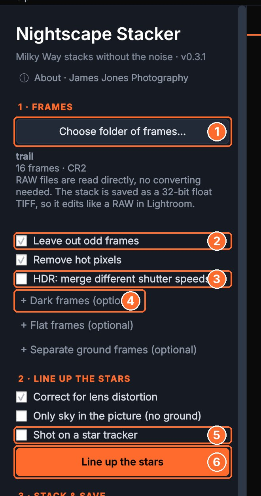
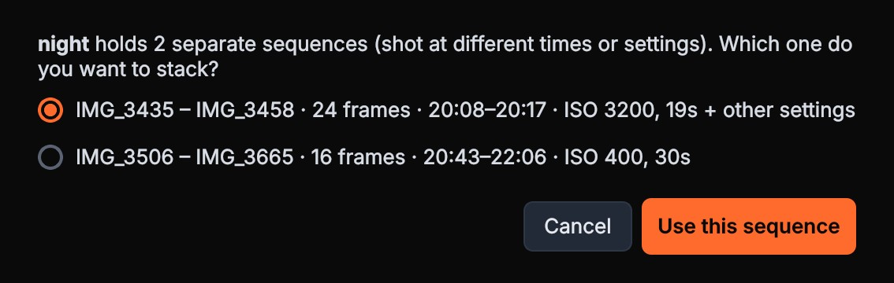
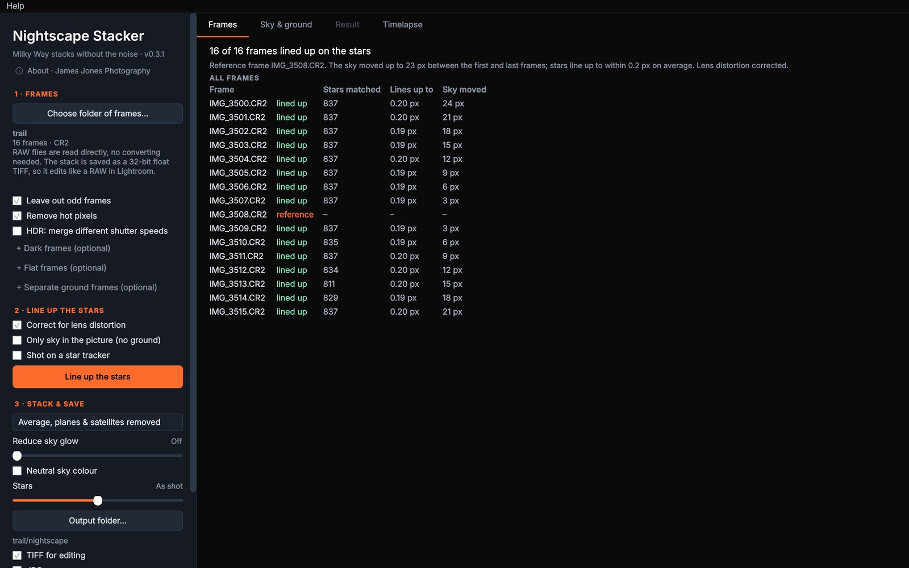
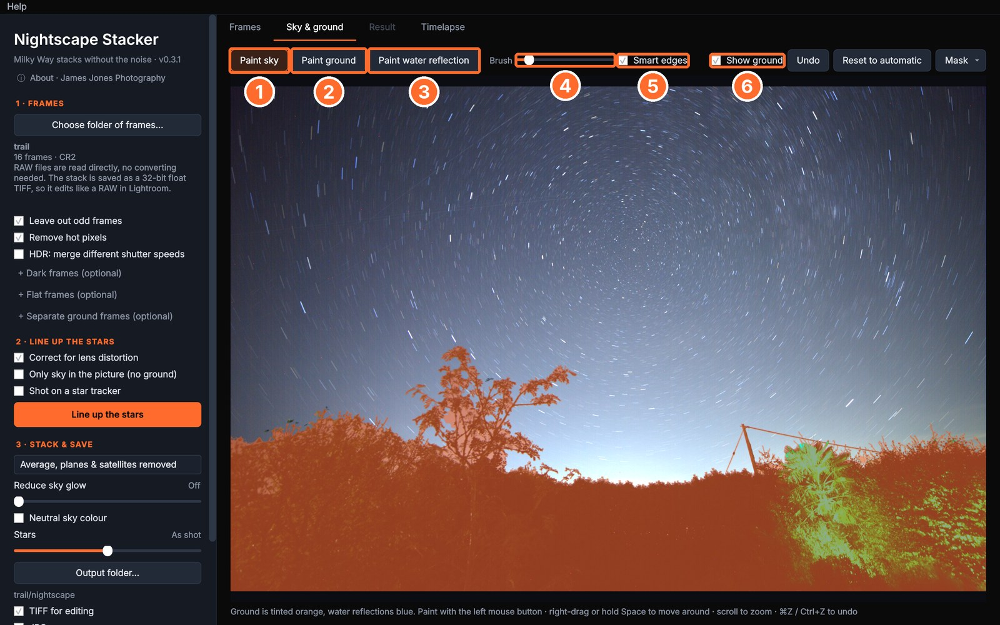
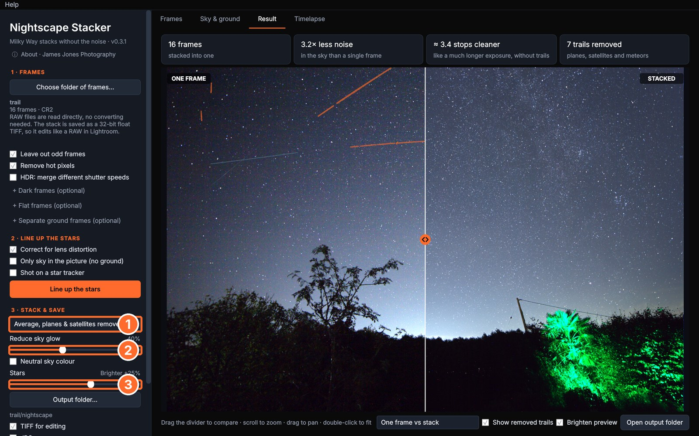
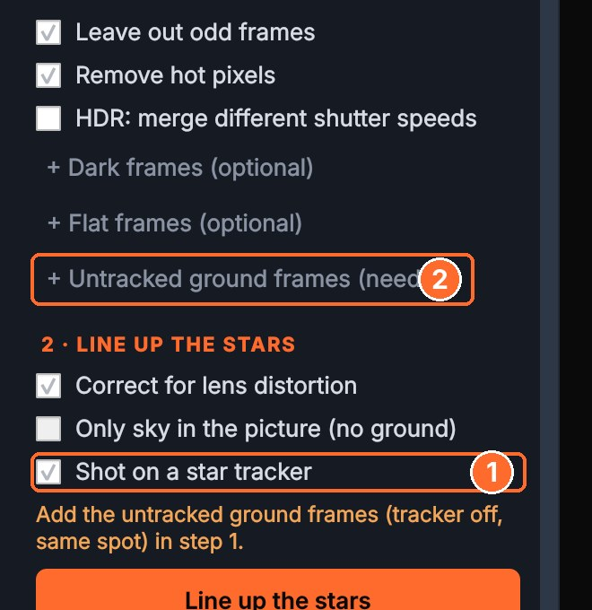
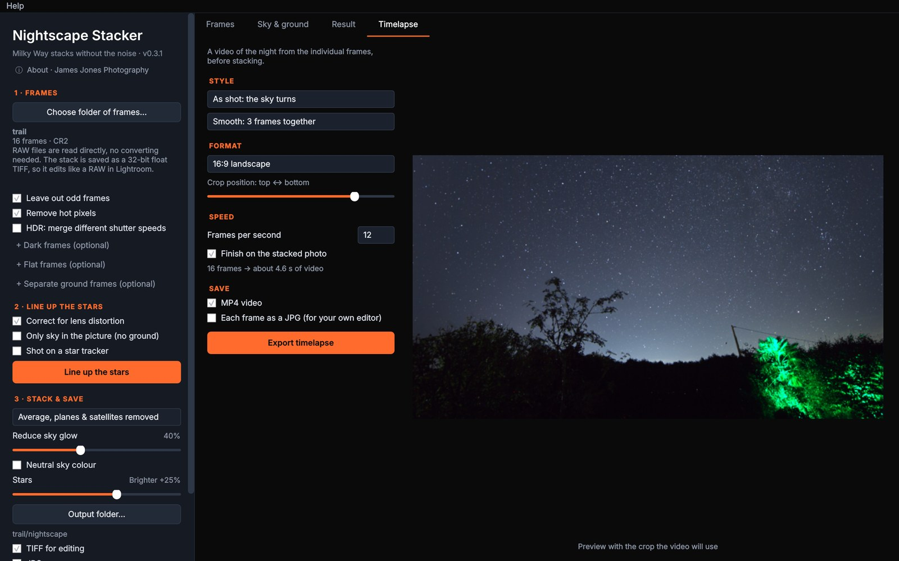

# How to use Nightscape Stacker

Nightscape Stacker combines a set of Milky Way or starry-landscape frames into one clean image. It lines the stars up across every frame, keeps the ground sharp, removes planes and satellites, and saves a 32-bit TIFF that edits like a RAW in Lightroom. Stacking 10–30 frames typically gives 3–5× less noise than a single frame.

**On this page:** [Before you shoot](#before-you-shoot) · [Quick start](#quick-start) · [Step 1: Frames](#step-1-choose-your-frames) · [Step 2: Line up the stars](#step-2-line-up-the-stars) · [Sky & ground](#check-the-sky--ground) · [Step 3: Stack & save](#step-3-stack--save) · [Star tracker](#shot-on-a-star-tracker) · [Timelapse](#make-a-timelapse) · [Lightroom](#editing-in-lightroom) · [Problems?](#problems-and-questions)

New to Nightscape Stacker? Download it from [the latest release](../../releases/latest), and see the [download page](README.md#opening-it-the-first-time) for opening it the first time.

---

## Before you shoot

- **Shoot RAW** on a tripod, and don't touch the camera between frames. Canon CR2/CR3, Nikon NEF, Sony ARW, Fuji RAF, DNG and more are read directly. TIFF and JPG work too.
- **Take 10–30 frames back to back** at the same settings. More frames give a cleaner sky.
- **Optional extras** that make a good result better:
    - **ground frames:** a blue-hour shot, a long low-ISO exposure or light painting, from the same spot;
    - **dark frames:** 5–10 with the lens cap on, at the same ISO and shutter speed;
    - **flat frames:** an evenly lit white subject (a tablet screen or the dawn sky), to remove vignetting and dust spots.

## Quick start

1. **Choose folder of frames…** and pick the folder with your frames.
2. Press **Line up the stars**.
3. Check the **Sky & ground** tab: the ground is tinted orange. Touch it up if needed.
4. Press **Stack & save**. Your TIFF and JPG are saved in a `nightscape` folder next to your frames.

## Step 1: Choose your frames

**① Choose folder of frames…** opens a folder picker. You can also drag a folder onto the window.

**A whole night's card in one folder?** Nightscape Stacker finds the separate sequences (shot at different times or settings) and asks which one you want. Lens-cap frames in the same folder are recognised and used as dark frames automatically.

**② Leave out odd frames** (on by default) spots test shots, headlights, the lens cap left on, passing cloud and frames where the camera was knocked. Each one is listed on the **Frames** tab with the reason, and you can put most of them back.

**③ HDR: merge different shutter speeds.** Tick this if you shot some frames shorter or longer, for example short frames to hold a bright core or the moon, or a long one for the foreground. They're merged instead of left out: blown highlights come from the shorter frames.

**④ + Dark frames (optional)**, **+ Flat frames (optional)** and **+ Separate ground frames (optional)** each take a folder. Dark frames are checked against your frames' ISO and shutter speed, and aren't used if they don't match. Ground frames are used for the landscape only, and a small tripod nudge between them and the sky frames is corrected.

 

## Step 2: Line up the stars

- **Correct for lens distortion** (on) keeps stars sharp right into the corners on wide-angle lenses.
- **Only sky in the picture (no ground):** tick this for frames with no landscape in them.
- **⑤ Shot on a star tracker:** see [Shot on a star tracker](#shot-on-a-star-tracker) below.
- **⑥ Line up the stars** finds the stars in a reference frame and follows them into every other frame. Trees, buildings and lights that don't move with the sky are ignored automatically. You never pick stars by hand.

The **Frames** tab then shows each frame, how many stars were matched and how closely it lines up. Under half a pixel is excellent.

## Check the sky & ground

The sky and the ground are stacked differently: the sky is lined up on the stars, the ground stays put. So the app needs to know which is which. It works this out automatically and tints the **ground orange**. Look it over, especially along the horizon and around trees.

- **① Paint sky** and **② Paint ground:** brush over anything that's wrong. Paint with the left mouse button.
- **③ Paint water reflection:** paint a lake or the sea that reflects the stars (shown blue). The mirror line is found for you, and the reflected stars are lined up their own way.
- **④ Brush** sets the brush size. The `[` and `]` keys work too.
- **⑤ Smart edges** (on) makes **Paint sky** only claim pixels as bright as the sky there, so you can brush loosely over branches without losing them.
- **⑥ Show ground** turns the orange tint on and off.
- **Undo** (⌘Z / Ctrl+Z) and **Reset to automatic** undo your changes.
- **Mask ▾** has **All sky (no ground)**, plus **Load mask from a file…** and **Save mask as a file…** for working in Photoshop (white = sky).

Scroll to zoom, and right-drag or hold Space to move around. Your edited mask is saved and comes back next time you open the same frames.

## Step 3: Stack & save

In **3 · Stack & save**:

- **① How frames are combined:**
    - **Average, planes & satellites removed** (default) drops planes, satellites, meteors and noise spikes;
    - **Plain average** keeps everything;
    - **Median** removes the most, but is a little noisier.
- **② Reduce sky glow** evens out light pollution and moon glow across the sky, leaving the ground and the Milky Way alone.
- **Neutral sky colour** removes the orange or green cast of light pollution and airglow from the sky.
- **③ Stars:** to the right, brighter starlight (faint stars are lifted without lifting the noise); to the left, smaller stars so the Milky Way's shape shows through. In the middle, **As shot**.
- **Output folder…**, plus **TIFF for editing**, **JPG**, and optionally **Also save sky and ground separately** (two TIFFs and the mask, for blending in Photoshop).
- **Stack & save** builds the image.

The **Result** tab compares one frame with the stack: drag the divider. The cards across the top show how many frames were stacked, how much cleaner the sky is, and how many trails were removed. **Show removed trails** marks them in orange. The view menu also has **Stack: sky vs ground layers**.

### What gets saved

| File | What it is |
|---|---|
| `milkyway.tif` | The one to edit: 32-bit float from RAW, with a matching colour profile |
| `milkyway.jpg` | Quick-look JPG |
| `milkyway_sky.tif`, `milkyway_ground.tif`, `milkyway_sky_mask.png` | Separate layers and the mask (if ticked) |
| `milkyway_report.json` | Frames used, alignment accuracy, settings and the noise measurement |
| `nightscape_session/` | Your edited mask, so it comes back next time |

## Shot on a star tracker

On a tracker the stars stay still and the landscape blurs, so you need two sets:

1. **The tracked sky frames.** Choose this folder in step 1 as usual.
2. **A few untracked frames** of the landscape, with tracking off, from the same spot. One works; more is cleaner.

Tick **① Shot on a star tracker**. The ground button changes to **② + Untracked ground frames (needed)**: pick the untracked folder there. Then press **Line up the stars**.

Nightscape Stacker takes the sky from the tracked frames and the sharp landscape from the untracked ones, lines them up for you, and fills any thin gap along the horizon. HDR is switched on for the ground automatically, so a longer foreground exposure blends in.

 

## Make a timelapse

The **Timelapse** tab makes a video from your individual frames, before stacking.

- **Style:**
    - **As shot: the sky turns** over a still landscape;
    - **Stars still: the landscape turns** under a fixed sky.
- **Smoothing:** **Smooth: 3 frames together** or **Extra smooth: 5** averages each video frame with its neighbours, lined up properly, so the video is far less grainy and planes drop out.
- **Format:** Original, 16:9 landscape, 9:16 vertical, 1:1 square or 4:5 portrait, with a crop slider.
- **Frames per second**, and **Finish on the stacked photo** to fade into your finished image at the end (after Stack & save).
- **Save:** an MP4 video and/or each frame as a JPG.

The timelapse needs tripod frames, so it isn't available in star tracker mode. A short set makes a short video: 24 frames at 12 fps is 2 seconds.

## Editing in Lightroom

Import `milkyway.tif` into Lightroom (or Photoshop / Camera Raw). It's a 32-bit linear file, so it opens a little flat, just like a RAW. Edit it as you would a RAW. Because the noise is already 3–5× lower, you can push contrast, clarity and the Milky Way's detail much further than with a single frame.

## Problems and questions

**Stars are doubled or smeared in the stack.** Check the **Frames** tab: frames that didn't line up are marked. If the camera was knocked during the set, those frames are left out automatically.

**The horizon has a dark or bright halo.** Go to **Sky & ground**, paint ground or sky along the edge, and press **Stack & save** again.

**A tree is blurred.** That part was treated as sky. Paint it as ground.

**Some frames were left out.** The **Frames** tab says why (test shot, different settings, headlights, cloud…). Most can be put back.

**My dark frames weren't used.** They must match your frames' ISO and shutter speed. The app tells you when they don't.

**The TIFF looks dark.** That's normal for a linear 32-bit file. Raise exposure in Lightroom, or use the JPG for a quick look.

**macOS or Windows won't open it.** See [opening it the first time](README.md#opening-it-the-first-time).

**Still stuck?** [Open an issue](../../issues), and say what you were doing, which camera and which computer.

---

Nightscape Stacker is free from [James Jones Photography](https://jamesjones.photography). Your original photos are never changed.
