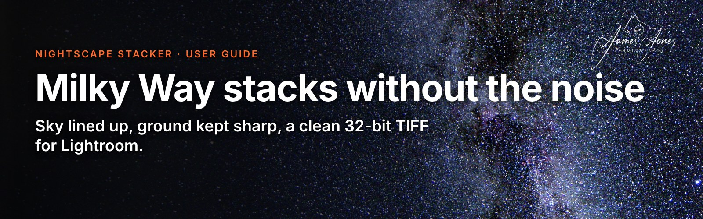

# Nightscape Stacker

**Milky Way stacks without the noise.** Free from [James Jones Photography](https://jamesjones.photography).

Stacks Milky Way and starry landscape frames: the stars are lined up automatically, the ground stays sharp, planes and satellites drop out, and you get a clean 32-bit TIFF for Lightroom. It also handles star tracker sets, mixed shutter speeds (HDR) and makes timelapses from the same frames. It reads your camera's RAW files directly (Canon CR2/CR3, Nikon, Sony, Fuji, DNG and more).

**New to Nightscape Stacker? Read the [step-by-step guide](GUIDE.md)** (also in the app under **Help → How to use Nightscape Stacker**).

## Features

- **Stars lined up automatically.** No picking stars by hand. It's accurate to a fraction of a pixel, and stays sharp right into the corners of wide-angle lenses.
- **Sharp ground.** The sky and the landscape are stacked separately. The boundary is found for you, including trees, poles and wires, and a smart brush makes touch-ups easy.
- **3–5× less noise** than a single frame, measured and shown on the result.
- **Planes and satellites removed**, with a map of exactly what was taken out.
- **Star tracker support:** combine tracked sky frames with untracked frames of the landscape.
- **HDR:** mix shutter speeds, for example short frames for a bright core or a long one for the foreground.
- **Stars slider:** brighter starlight or smaller stars, without lifting the noise.
- **Sky glow and colour cast removal** for light pollution and moonlight, applied to the sky only.
- **Timelapse videos** from the same frames, smoothed and with the planes removed, in 16:9, 9:16, 1:1 or 4:5.
- **Whole-night folders:** it finds the separate sequences on a card, and uses lens-cap frames as dark frames automatically.
- **Dark frames, flat frames, blue-hour ground frames** and **water reflections** are all supported.
- **RAW straight from the camera** and a **32-bit TIFF** with a matching colour profile that edits like a RAW in Lightroom.
- **Mac and Windows**, free, with update notifications built in.

## Download

Go to **[the latest release](../../releases/latest)** and download the file for your computer:

| Computer | File |
|---|---|
| Mac with Apple silicon (M1 or newer) | `NightscapeStacker-mac-apple-silicon.zip` |
| Windows 10 or 11 (64-bit) | `NightscapeStacker-windows.zip` |

## Opening it the first time

Nightscape Stacker is free and isn't signed with a paid Apple or Microsoft certificate, so your computer asks you to confirm the first time you open it. This is normal for free apps from independent makers.

**Mac**

1. Double-click the zip to unzip it, then drag **Nightscape Stacker.app** into your **Applications** folder.
2. Double-click it. macOS says it can't verify the app: click **Done**.
3. Open **System Settings → Privacy & Security**, scroll down to **Security**, and click **Open Anyway** next to the message about Nightscape Stacker. Enter your password if asked, then click **Open**.

You only do this once (and again after installing an update).

**Windows**

1. Right-click the zip and choose **Extract All…** (don't run it from inside the zip).
2. Open the **NightscapeStacker** folder and double-click **NightscapeStacker.exe**.
3. If a blue "Windows protected your PC" box appears, click **More info**, then **Run anyway**.

## Updates

Nightscape Stacker checks this page when it opens and shows a banner when there's a new version. Click **Download**, then replace your old copy with the new one. You can turn the check off in the **Help** menu.

## Feedback and problems

Found a bug or have an idea? [Open an issue](../../issues) and say what you were doing, which camera and which computer.

## Licence

Nightscape Stacker is free to use. Please don't sell it or share modified copies. © 2026 James Jones Photography. It's built with open-source software; the full list and licences are in the app under **About → Open-source licences**.
